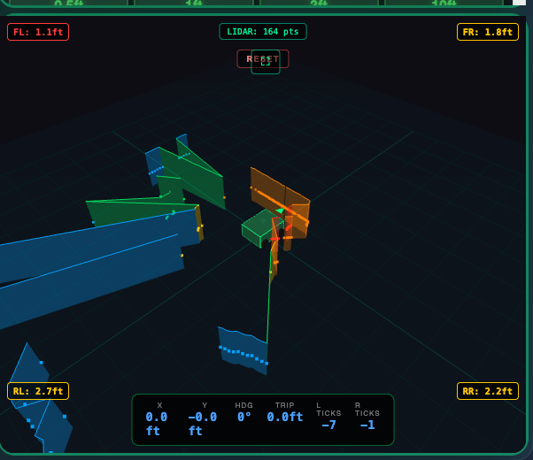

<div align="center">

# Cemani Homestead Robot

### Autonomous Tank Platform for Homestead Automation


**Built to protect chickens, automate chores, and give kids rides around the homestead**

[Demo Videos](#demo) | [Web Interface](#-web-interface) | [Hardware](#-hardware) | [Code](#-code-examples)

</div>

---

## Demo

### Robot Pulling Firewood Cart

https://github.com/user-attachments/assets/6a05e239-ce66-46ee-b951-474730370bfe

*Successfully pulling a loaded metal cart - first real-world test!*

---

### Build Process

<table>
<tr>
<td width="50%">

**Chassis Assembly**


*2020 aluminum extrusion frame with motor mounts*

</td>
<td width="50%">

**Electronics Bay**


*Teensy 4.1, ESP32, ZLAC drivers, power distribution*

</td>
</tr>
</table>

### Testing Footage

<table>
<tr>
<td width="33%">

https://github.com/user-attachments/assets/9921ebb9-426a-4740-9e35-a875a7818416

*Initial mobility test*

</td>
<td width="33%">

https://github.com/user-attachments/assets/a52f8c41-8795-4027-825c-4a8bdb81a10c

*Maneuverability demo*

</td>
<td width="33%">

https://github.com/user-attachments/assets/fd26b6ea-948a-4a99-8cf5-652a429bc2db

*Speed testing*

</td>
</tr>
</table>


*Hub motors, shocks, and wheel assembly*

---

## Web Interface

**Control and monitor your robot from ANYWHERE in the world!**



*Command Center featuring dual PTZ cameras, real-time 3D LIDAR mapping, tank drive controls with GO/STOP buttons, ultrasonic proximity sensors, position tracking, and complete telemetry dashboard*

### Features

| Category | Features |
|----------|----------|
| **Controls** | Tank drive with L/R steering, distance presets (0.5ft/1ft/3ft/10ft), GO/STOP buttons |
| **LIDAR** | Real-time 3D point cloud visualization, 360° scanning, obstacle detection |
| **Telemetry** | Motor RPM, battery voltage (%), driver temps, WiFi signal, uptime |
| **Cameras** | Dual PTZ with RTSP streaming, ONVIF pan/tilt, two-way audio |
| **Sonar** | 4x ultrasonic sensors with color-coded proximity badges (FL/FR/RL/RR) |
| **Dev Tools** | Serial monitor popup, code editor, wireless compile & upload |
| **Tracking** | Position tracker with X/Y coordinates, heading, trip distance, encoder ticks |

### Architecture

```
┌─────────────────────────────────────────────────────────────┐
│                    ANYWHERE IN THE WORLD                     │
│                                                              │
│   Browser ──HTTPS/WebSocket──► VPS Server (Node.js)         │
│                                      │                       │
│                               WebSocket                      │
│                                      ▼                       │
│   ┌────────────────────────────────────────────────────┐    │
│   │                  ROBOT HARDWARE                     │    │
│   │                                                     │    │
│   │  8BitDo Controller ◄──Bluetooth──► ESP32           │    │
│   │                                      │              │    │
│   │                                   Serial            │    │
│   │                                      ▼              │    │
│   │                                  Teensy 4.1         │    │
│   │                                      │              │    │
│   │                                   Modbus            │    │
│   │                                      ▼              │    │
│   │                              ZLAC8015D Drivers      │    │
│   │                                      │              │    │
│   │                    ┌─────────────────┼─────────────┐│    │
│   │                    ▼         ▼       ▼         ▼   ││    │
│   │                 [FL]      [FR]    [RL]      [RR]   ││    │
│   └────────────────────────────────────────────────────┘│    │
└─────────────────────────────────────────────────────────────┘
```

---

## Hardware

### Core Platform

| Component | Specs | Purpose |
|-----------|-------|---------|
| **4x Hub Motors** | ZLLG80ASM250, 9 lbs each | Tank drive (2 per side, encoded) |
| **2x Motor Drivers** | ZLAC8015D Dual-Channel | Modbus RTU control |
| **Teensy 4.1** | 600MHz ARM Cortex-M7 | Main controller & Modbus master |
| **ESP32** | Bluetooth 5.0 + WiFi | Controller + web bridge |
| **8BitDo Ultimate 5.1** | Bluetooth | Wireless gamepad control |

### Power System

| Component | Specs | Purpose |
|-----------|-------|---------|
| **2x 30Ah 12V LiFePO4** | Series = 24V, 720Wh | Motor power |
| **5V Buck Converter** | 25W Waterproof Automotive | Teensy, ESP32, logic |
| **12V Buck Converter** | Waterproof Automotive | Cameras, accessories |
| **19V Buck Converter** | Waterproof Automotive | Jetson Orin Nano |
| **Breakers** | 2x 40A + 1x 50A | Overcurrent protection |

### Sensors & Cameras

| Component | Specs | Status |
|-----------|-------|--------|
| **RPLidar A1** | 360°, 12m range, 8000 samples/sec | ✅ Working |
| **4x Ultrasonic** | JSN-SR04T-V3.0, 21-600cm | ✅ Working |
| **2x PTZ Cameras** | Sricam 1080p RTSP/ONVIF | ✅ Working |
| **GPS Module** | u-blox NEO-M8N | 🔜 Next |

### Computing

| Component | Specs | Purpose |
|-----------|-------|---------|
| **Jetson Orin Nano Super** | 8GB, 67 TOPS | AI brain (on robot) |
| **VPS Server** | Ubuntu 24.04 | Remote command center |

---

## Current Status

**Weight:** 65 lbs | **Status:** Remote control anywhere ✅

### What's Working

| Feature | Status | Notes |
|---------|:------:|-------|
| Tank Drive Platform | ✅ | 4WD hub motors, pulls loaded carts |
| 8BitDo Controller | ✅ | Bluetooth via ESP32, exponential curves |
| Web Command Center | ✅ | Control from anywhere, glassmorphism UI |
| **3D LIDAR Mapping** | ✅ | Real-time 360° point cloud, obstacle visualization |
| Dual PTZ Cameras | ✅ | RTSP streaming, ONVIF pan/tilt |
| Audio Streaming | ✅ | Hear surroundings through browser |
| Wireless Programming | ✅ | Flash Teensy from browser |
| Ultrasonic Sonar | ✅ | 4x sensors, color-coded proximity badges |
| Position Tracking | ✅ | X/Y coordinates, heading, trip distance |
| Driver Telemetry | ✅ | Battery V, temps, RPM, WiFi signal |
| Safety Auto-Stop | ✅ | Stops if connection lost |

### Coming Next

| Feature | Status | Notes |
|---------|:------:|-------|
| GPS Navigation | 🔜 | All-weather positioning |
| SLAM Navigation | 🔜 | Using LIDAR for autonomous mapping |
| Predator Detection | 🔜 | YOLOv8 on Jetson |
| Autonomous Patrol | 🔜 | Waypoint navigation |

---

## Phase Completion

```
✅ Phase 1:   Tank chassis with 4WD hub motors
✅ Phase 2:   Controller → ESP32 → Teensy → Motors
✅ Phase 3:   RS-485 Modbus communication
✅ Phase 4:   Cart pulling test successful
✅ Phase 5:   Synchronized motor control
✅ Phase 6:   Turn mode with smooth steering
✅ Phase 6.5: Web Command Center
✅ Phase 6.6: Wireless programming (VPS compilation)
✅ Phase 6.7: Remote PTZ camera + audio
✅ Phase 6.8: D-pad camera control
✅ Phase 6.9: Dual control (controller + web)
✅ Phase 6.10: Safety auto-stop
✅ Phase 6.11: Driver telemetry via Modbus
✅ Phase 6.12: Ultrasonic proximity sensors
✅ Phase 6.13: 3D LIDAR mapping with real-time visualization
✅ Phase 6.14: Position tracking with odometry
🔜 Phase 7:   Autonomous patrol (Jetson + SLAM + GPS)
🔜 Phase 8:   Deterrent system (siren, strobes)
```

---

## Network Architecture

```
┌─────────────────────────────────────────────────────────────────┐
│                     MULTI-NETWORK OPERATION                      │
├─────────────────────────────────────────────────────────────────┤
│                                                                  │
│  AT HOME:                                                        │
│  [Robot] ──WiFi──► [Router] ──► [Jetson Relay] ──► [VPS]        │
│                                      │                           │
│                                 (camera relay)                   │
│                                                                  │
│  ANYWHERE ELSE:                                                  │
│  [Robot] ──WiFi──► [Any Network] ──► [VPS] ──► [Browser]        │
│                                                                  │
│  FUTURE (Jetson on robot):                                       │
│  [Robot+Jetson] ──► [Any Network] ──► [VPS] ──► [Browser]       │
│       └── EVERYTHING works from ANYWHERE                         │
│                                                                  │
└─────────────────────────────────────────────────────────────────┘
```

---

## Battery Performance

| Mode | Power Draw | Runtime |
|------|------------|---------|
| Idle (electronics only) | ~5W | ~6 days |
| With cameras streaming | ~15W | ~2-3 days |
| Light patrol | ~20W avg | ~36 hours |
| Active driving | ~400W | ~2 hours |

*Tested: Robot ran for 1 week with motor testing + 2 days camera streaming with battery to spare.*

---

## Code Examples

### Tank Drive Mixing
```cpp
void calculateTankSpeeds(int16_t lx, int16_t ly, int16_t& left_out, int16_t& right_out) {
  if (abs(lx) < 20) lx = 0;
  if (abs(ly) < 20) ly = 0;

  float forward = (float)ly / 511.0 * MAX_SPEED;
  float turn = (float)lx / 511.0 * MAX_SPEED;

  left_out = constrain(forward + turn, -MAX_SPEED, MAX_SPEED);
  right_out = constrain(forward - turn, -MAX_SPEED, MAX_SPEED);
}
```

### Modbus Command
```cpp
void setDriverSpeed(uint8_t driver_id, int16_t rpm) {
  uint8_t frame[8];
  frame[0] = driver_id;
  frame[1] = 0x06;               // Write Single Register
  frame[2] = 0x20;
  frame[3] = (driver_id == 1) ? 0x88 : 0x89;
  frame[4] = (rpm >> 8);
  frame[5] = (rpm & 0xFF);

  uint16_t crc = crc16(frame, 6);
  frame[6] = (crc & 0xFF);
  frame[7] = (crc >> 8);

  Serial2.write(frame, 8);
}
```

---

## Lessons Learned

### The $200 Mistake: Hobby Buck Converters

| Destroyed | Qty | Cause | Cost |
|-----------|:---:|-------|------|
| Teensy 4.1 | 4 | DROK voltage spikes | ~$120 |
| ESP32 | 3+ | DROK voltage spikes | ~$30 |
| Buck Converters | 3-4 | Failed under load | ~$40 |
| **Total** | - | Hobby-grade power | **~$190** |

**Solution:** Switched to automotive-grade waterproof buck converters. **Zero failures since.**

### Other Hard-Won Lessons

- **Ground everything together** - Most "weird behavior" is a grounding problem
- **Tank steering is hard** - Coordinating 4 motors via 2 Modbus drivers takes time
- **Build monitoring early** - Remote debugging saves hours
- **Test hardware before code** - Real-world reveals what simulation can't

---

## Project Structure

```
CemaniHomesteadRobot/
├── teensy-robot/           # Motor control firmware (PlatformIO)
├── esp32-robot-controller/ # Bluepad32 + WiFi + WebSocket
├── vps-server/             # Node.js server + Command Center UI
├── jetson-lidar/           # LIDAR processing on Jetson Orin Nano
├── jetson-camera-relay/    # Camera relay for Jetson
├── mac-camera-relay/       # Camera relay for Mac
├── ZLAC8015D-V2.0/         # Driver documentation
└── docs/                   # Images and diagrams
```

---

## Roadmap

### Completed
- [x] LIDAR integration with 3D visualization
- [x] Position tracking with odometry
- [x] Jetson Orin Nano integration

### Next Up
- [ ] GPS module installation
- [ ] SLAM-based autonomous navigation
- [ ] YOLOv8 predator detection

### Future
- [ ] Autonomous patrol routes
- [ ] Siren + strobe deterrents
- [ ] Train body for kids
- [ ] Fish-controlled mode (because why not)

---

## Resources

| Resource | Link |
|----------|------|
| RealTime AI Cam | [github.com/nicedreamzapp/RealTimeAICam](https://github.com/nicedreamzapp/RealTimeAICam) |
| Bluepad32 | [github.com/ricardoquesada/bluepad32](https://github.com/ricardoquesada/bluepad32) |
| Reddit Discussion | [r/robotics thread](https://www.reddit.com/r/robotics/comments/1ov3k5v/) |

---

## Contributing

- ⭐ **Star** if this helped your build
- 🐛 **Issues** for questions
- 💬 **Discussions** for robot stories
- 🔧 **PRs welcome**

---

## License

MIT License - Use this for your own robot projects!

---

<div align="center">

**Built with ❤️ on a homestead in Humboldt County, California**

*Started with a chicken problem, ended up building an autonomous homestead assistant.*

### "If it takes more than 10 minutes, automate it."

[Website](https://nicedreamzwholesale.com) | [GitHub](https://github.com/nicedreamzapp)

</div>
