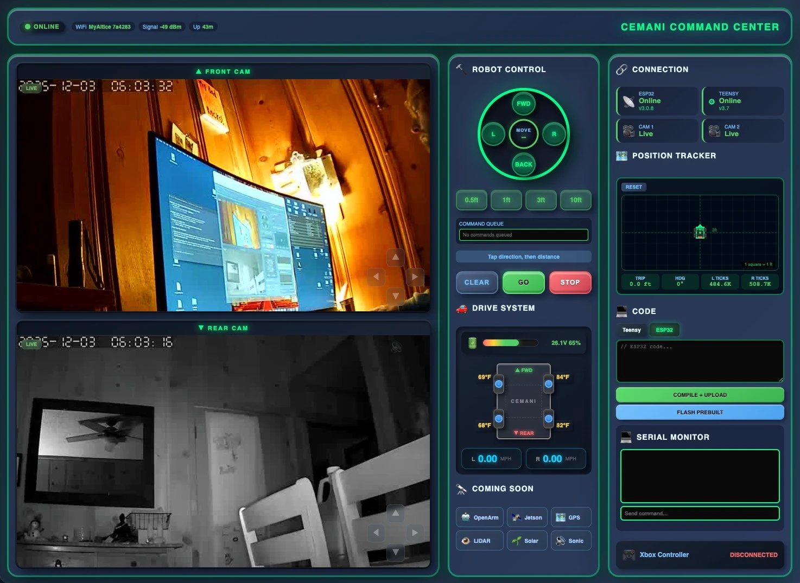

<div align="center">

# 🤖 Cemani Homestead Robot

### Autonomous Dual-Armed Tank Platform for Homestead Automation


**Built to protect chickens, automate chores, and give kids rides around the homestead**

[📹 Demo Videos](#demo) • [🌐 Web Interface](#-web-interface) • [🔧 Hardware](#hardware) • [🤖 The Vision](#the-vision) • [💻 Code](#code)

</div>

---

## 🎥 Demo

### Robot Pulling Firewood Cart

https://github.com/user-attachments/assets/6a05e239-ce66-46ee-b951-474730370bfe

*Successfully pulling a loaded metal cart - first real-world test after 6 months of building and learning.*

---

### Build Process & Testing

<table>
<tr>
<td width="50%">

**Chassis Assembly**


*2020 aluminum extrusion frame with motor mounts*

</td>
<td width="50%">

**Electronics Bay**


*Teensy 4.1, ESP32, ZLAC drivers, and power distribution*

</td>
</tr>
</table>

### More Testing Footage

<table>
<tr>
<td width="33%">

https://github.com/user-attachments/assets/9921ebb9-426a-4740-9e35-a875a7818416

*Initial mobility test*

</td>
<td width="33%">

https://github.com/user-attachments/assets/a52f8c41-8795-4027-825c-4a8bdb81a10c

*Maneuverability demo*

</td>
<td width="33%">

https://github.com/user-attachments/assets/fd26b6ea-948a-4a99-8cf5-652a429bc2db

*Speed testing*

</td>
</tr>
</table>

### Component Details


*Hub motors, shocks, and wheel assembly*

---

## 🌐 Web Interface

**Control and monitor your robot from ANYWHERE in the world!**



*Futuristic glassmorphism command center with virtual joystick, real-time telemetry, code editor, and system monitoring*

### Futuristic Command Center Dashboard
**Design:** Glassmorphism UI with cyberpunk aesthetic - liquid glass effects, 3D embossing, spaceship cockpit vibes

**Features:**
- 🎮 **Virtual Joystick** - Tank steering control (simulates Xbox controller)
- 📊 **Real-Time Telemetry** - Live motor RPM, WiFi signal, session stats
- 🖥️ **Serial Monitor** - Watch Teensy debug output in browser
- 💻 **Code Editor** - Edit Teensy/ESP32/Driver code with syntax highlighting
- ⚡ **Compile & Upload** - Wireless firmware updates via browser
- 📡 **Command Input** - Send custom commands to robot
- 🔄 **Reset Button** - Soft reset (simulates Xbox A button)
- 📷 **Camera Feeds** - Dual IP camera streams (future)
- 🔋 **System Status** - ESP32, Teensy, ZLAC drivers health
- 🛰️ **Future Sensors** - Jetson Orin, LiDAR, GPS, PIR, OpenArm placeholders

**Tech:** Glassmorphism CSS (backdrop-filter, blur, transparency), WebSocket real-time updates, Monaco editor integration

### Architecture
```
┌──────────────────────────────────────────────────────────────────┐
│                     ANYWHERE IN THE WORLD                         │
│   ┌─────────────────┐                                            │
│   │ Your Phone/PC   │──────┐                                     │
│   │   Any Browser   │      │                                     │
│   └─────────────────┘      │ HTTPS/WebSocket                     │
│                             ▼                                     │
│              ┌──────────────────────────────┐                    │
│              │  your-robot-domain.com       │                    │
│              │  (VPS - Node.js + Nginx)     │                    │
│              └───────────────┬──────────────┘                    │
│                              │ WebSocket                          │
│                              ▼                                     │
│   ┌────────────────────────────────────────────────────────┐    │
│   │                    ROBOT HARDWARE                       │    │
│   │  ┌─────────┐   Serial   ┌─────────┐   Modbus          │    │
│   │  │  ESP32  │◄──────────►│ Teensy  │◄────────►Motors   │    │
│   │  │ (WiFi+  │            │  4.1    │                    │    │
│   │  │  OTA)   │            └─────────┘                    │    │
│   │  └────┬────┘                                            │    │
│   │       │ Bluetooth                                       │    │
│   │       ▼                                                 │    │
│   │  ┌─────────┐                                            │    │
│   │  │  Xbox   │                                            │    │
│   │  │Controller│                                           │    │
│   │  └─────────┘                                            │    │
│   └────────────────────────────────────────────────────────┘    │
└──────────────────────────────────────────────────────────────────┘
```

### How It Works
1. **ESP32 connects to WiFi** on robot startup (home, hotspot, or work)
2. **Opens WebSocket** to your VPS server
3. **Sends Teensy serial data** to VPS in real-time
4. **Your browser connects** to VPS and sees live serial output
5. **Xbox controller still works** locally via Bluetooth - web doesn't interfere!

### Tech Stack
- **VPS:** Ubuntu 24.04 (any hosting provider works)
- **Backend:** Node.js WebSocket server with PM2 process manager
- **Frontend:** Vanilla HTML/CSS/JS (no frameworks needed)
- **Reverse Proxy:** Nginx for subdomain routing
- **Security:** HTTP Basic Auth (password protected)
- **ESP32:** WiFiMulti + WebSocket client + Bluepad32

---

## 🎯 The Vision

**The Problem:** Backyard predators attacking my chickens. Manual homestead labor. Kids want robot rides.

**The Solution:** Build a dual-armed autonomous robot that can:

### Primary Mission: Chicken Protection
- 🐔 **Patrol property** using computer vision to detect predators
- 👁️ **601-class object detection** via [RealTime AI Cam](https://github.com/nicedreamzapp/RealTimeAICam)
- 🔊 **Scare off predators** through motion and sound
- ⏰ **Automated feeding** at scheduled times

### Dual-Arm Manipulation (OpenArm 0.1 Integration Planned)
Using two robotic arms for human-like bilateral manipulation:
- 🥣 **Feed chickens** by scooping from containers
- 📦 **Pack boxes** for shipping
- 🧺 **Carry laundry** from dryer to basket
- 🍽️ **Handle dishware** and containers
- 🏗️ **Grab parts** from stockroom shelves
- 🪵 **Load/unload** materials autonomously

### Family Fun
- 🚂 **Train engine body** (cardboard/3D printed) for kids to ride in cars behind it
- 🏴‍☠️ **Swappable bodies** - pirate ship, fire truck, space shuttle
- 🐠 **Fish-controlled mode** (aquarium on top, fish steers via camera tracking)

---

## 📊 Current Status

**Weight:** 65 lbs (can handle 80+ lbs more with reinforcement)  
**Build Time:** 6 months from zero robotics knowledge  
**Status:** Mobile platform complete ✅ | Adding autonomy next 🚧

### Phase Completion
- ✅ **Phase 1:** Tank chassis with 4WD hub motors
- ✅ **Phase 2:** Xbox controller → ESP32 → Teensy → Motors
- ✅ **Phase 3:** RS-485 Modbus communication working
- ✅ **Phase 4:** Successfully pulled loaded cart
- ✅ **Phase 5:** Synchronized motor control (atomic Modbus writes)
- ✅ **Phase 6:** Turn mode with reduced speed/acceleration
- ✅ **Phase 6.5:** Web interface for remote monitoring/control
- 🚧 **Phase 7:** Autonomous predator patrol (Jetson + Lidar + YOLO)
- 🔜 **Phase 8:** Deterrent system (siren, strobes, bear spray)
- 🔜 **Phase 9:** OpenArm integration (future)

---

## 🔧 Hardware

### Mobile Platform (Complete)

| Component | Specs | Purpose |
|-----------|-------|---------|
| **4x Hub Motors** | ZLLG80ASM250, 9 lbs each | Tank drive (2 per side, encoded) |
| **2x Motor Drivers** | ZLAC8015D Dual-Channel | Each controls one side via Modbus |
| **Teensy 4.1** | 600MHz ARM Cortex-M7 | Main controller & Modbus master |
| **ESP32** | Bluetooth 5.0 + WiFi | Xbox controller + web interface |
| **RS-485 Module** | MAX3485 | Modbus RTU communication |
| **2x 12V LiFePO4** | Series = 24V | Motor power (low CoG mounting) |
| **Buck Converter** | DROK 24V→5V | Logic power with filtering |
| **Xbox Controller** | Bluetooth 5.0 | Wireless control |
| **2020 Extrusion** | Aluminum | Chassis frame |
| **Aluminum Plates** | Various | Mounting & structure |
| **4x Shocks** | Electric scooter | Suspension for terrain |
| **Fuses & Breakers** | 10A input, 2A output | Protection |
| **Capacitors** | 100µF input/output | Power filtering |
| **VPS Server** | Ubuntu 24.04 | Remote monitoring backend |

### Phase 7: Autonomous Predator Patrol (In Progress)

**All-Weather Sensor Redundancy:**
| Sensor | Good Weather | Rain/Fog | Purpose |
|--------|--------------|----------|---------|
| RPLidar A1 | ✅ Mapping | ❌ Docked | Precise SLAM navigation |
| GPS | ✅ Position | ✅ Position | Absolute location on property |
| Ultrasonics x4 | ✅ Obstacles | ✅ Obstacles | Backup obstacle avoidance |
| IR Camera | ✅ Detection | ✅ Detection | Predator identification |

**Hardware:**
| Component | Specs | Purpose |
|-----------|-------|---------|
| **Jetson Orin Nano Super** | 8GB, 67 TOPS | AI brain - runs YOLO + navigation offline |
| **NVMe SSD** | 256GB KingSpec | Fast storage for Jetson |
| **5V 5A Buck Converter** | Waterproof automotive | Jetson power from 24V battery |
| **RPLidar A1** | 360°, 12m range | Mapping & obstacle avoidance (fair weather) |
| **GPS Module** | u-blox NEO-M8N | Waypoint navigation (all weather) |
| **Ultrasonics x4** | JSN-SR04T, IP67 | Obstacle avoidance (all weather backup) |
| **IR Night Camera** | Arducam 1080p | Predator detection day/night |
| **Industrial PIR Sensor** | 100-200ft range, 12V | Wake system during patrol breaks |
| **Siren/Speaker** | 120dB marine horn | Scare deterrent |
| **Strobe Lights** | 12V LED bar | Visual deterrent |
| **Bear Spray Mount** | Servo-triggered | Last resort deterrent |

### Future Additions

| Component | Specs | Purpose |
|-----------|-------|---------|
| **2x OpenArm 0.1** | 3-5kg lift each | Bilateral manipulation (later phase) |
| **Train Body** | Cardboard/3D printed | Kid transport mode |

---

## 🤖 The Vision: Dual-Armed Autonomy

### Why Two Arms?
OpenArm 0.1 provides **bilateral manipulation** - the ability to coordinate two arms like a human:
- One arm stabilizes a container while the other scoops
- Both arms work together to pack boxes efficiently  
- Coordinate lifting and placing objects
- Handle larger items that need two-point grip

### Planned Tasks

**Daily Chicken Care:**
1. Robot navigates to feed storage at scheduled time
2. Uses object detection to locate chicken feed container
3. One arm opens/stabilizes lid, other arm scoops feed
4. Distributes feed to multiple feeding stations
5. Chickens learn to gather when they see/hear the robot

**Package Handling:**
1. Vision system identifies box on shelf
2. Retrieves box with coordinated arm movement
3. Places in packing area
4. Fills with items from stockroom
5. Closes and labels for shipping

**Laundry Assistance:**
1. Detects dryer completion signal
2. Opens dryer door with one arm
3. Retrieves clothing with other arm
4. Places in basket for transport
5. Delivers to folding area

**Predator Patrol:**
- Autonomous perimeter patrol on schedule
- Computer vision detects animals (raccoons, foxes, coyotes)
- Approaches with lights/sounds to scare them away
- Arms can wave/gesture to appear larger
- Logs encounters for analysis

---

## 💻 Software Architecture

### Current Stack (Platform Control + Web Interface)
```
┌─────────── LOCAL CONTROL ────────────┐  ┌──── REMOTE MONITORING ────┐
│                                       │  │                            │
│  Xbox Controller (BT 5.0)            │  │   Your Phone/Browser       │
│       ↓                               │  │           │                │
│  ESP32 (Bluepad32 + WiFi + OTA)      │  │           │                │
│       ↓ Serial (115200 baud)         │  │           ▼                │
│  Teensy 4.1                           │  │  VPS WebSocket Server      │
│       ↓ RS-485 (Modbus RTU)          │  │   (Node.js + Nginx)        │
│  MAX3485 Module                       │  │           │                │
│       ↓ Twisted Pair A/B             │  │           │                │
│  ┌──────────────────┬──────────────┐ │  │           │                │
│  ZLAC8015D (ID=1)   ZLAC8015D (ID=2) │  │           │                │
│  ├─ Motor 1 (FL)    ├─ Motor 1 (FR) │  │           │                │
│  └─ Motor 2 (RL)    └─ Motor 2 (RR) │  │           │                │
│                                       │  │           │                │
└───────────────────────────────────────┘  └───────────┴────────────────┘
                                                       │
                                           ┌───────────┴───────────┐
                                           │                        │
                                       WebSocket              WebSocket
                                        (Serial Data)         (Commands)
                                           │                        │
                                           └────────────┬───────────┘
                                                        │
                                                   ESP32 WiFi
```

### Autonomous Patrol Stack (Phase 7)
```
Industrial PIR Sensor (100-200ft)
    ↓ Wake Signal
Jetson Orin Nano (67 TOPS)
    ├─ RPLidar A1 (fair weather SLAM)
    ├─ GPS Module (all-weather position)
    ├─ Ultrasonics x4 (all-weather obstacles)  
    ├─ IR Camera (YOLOv8 predator detection)
    ├─ Navigation Planning (ROS2)
    ├─ Object Detection (YOLO)
    └─ Behavior Trees (task execution)
    ↓ Serial Commands
Teensy 4.1 (motion control)
    ↓ Modbus
Motor Drivers + Deterrent Systems
```

### Planned High-Level Stack
```
Python/ROS2 (Jetson)
    ├─ Task Scheduler
    ├─ Path Planning  
    ├─ Object Detection (RealTime AI Cam)
    └─ OpenArm Control
    ↓ Serial Commands
Teensy 4.1 (Real-time Control)
    ├─ Motor Control (Modbus)
    ├─ Sensor Fusion
    └─ Safety Override
```

---

## 🎨 Design Philosophy

### "Gaming Desktop" Aesthetic
**Current:** Functional prototype with exposed wiring  
**Goal:** Clean cable management with:
- Cable sleeves matching chassis color
- RGB LED accent lighting
- Transparent panels to show internals
- Custom 3D-printed cable guides
- Professional wire routing

### Modular Bodies
Swappable top structures for different modes:
- 🚂 **Train Engine** - For pulling kids in cars
- 🏴‍☠️ **Pirate Ship** - Cardboard sails and cannons
- 🐠 **Fish Tank** - Let fish control movement via tracking
- 🚜 **Utility Bed** - Open platform for cargo
- 🤖 **Humanoid Torso** - With dual arms exposed

---

## 📝 Code Examples

### Tank Drive with Acceleration Ramping
```cpp
void calculateTankSpeeds(int16_t lx, int16_t ly, int16_t& left_out, int16_t& right_out) {
  // Deadzone handling
  if (abs(lx) < 20) lx = 0;
  if (abs(ly) < 20) ly = 0;
  
  // Scale to motor range (-3000 to +3000 RPM)
  float forward = (float)ly / 511.0 * MAX_SPEED;
  float turn = (float)lx / 511.0 * MAX_SPEED;
  
  // Tank drive mixing
  float left_f = forward + turn;
  float right_f = forward - turn;
  
  // Smooth acceleration ramping
  left_f = rampSpeed(prevLeft, left_f, ACCEL_RATE);
  right_f = rampSpeed(prevRight, right_f, ACCEL_RATE);
  
  // Constrain and output
  left_out = constrain((int16_t)left_f, -MAX_SPEED, MAX_SPEED);
  right_out = constrain((int16_t)right_f, -MAX_SPEED, MAX_SPEED);
}
```

### Modbus Command Structure
```cpp
void setDriverSpeed(uint8_t driver_id, int16_t rpm) {
  uint8_t frame[8];
  frame[0] = driver_id;          // 1=left, 2=right
  frame[1] = 0x06;               // Write Single Register
  frame[2] = 0x20;               // Register hi byte
  frame[3] = (driver_id == 1) ? 0x88 : 0x89;
  frame[4] = (rpm >> 8);         // Speed hi byte
  frame[5] = (rpm & 0xFF);       // Speed lo byte
  
  uint16_t crc = crc16(frame, 6);
  frame[6] = (crc & 0xFF);       // CRC lo
  frame[7] = (crc >> 8);         // CRC hi
  
  Serial2.write(frame, 8);
}
```

### ESP32 WebSocket Connection
```cpp
// Connect to VPS WebSocket server
WebSocketsClient webSocket;
webSocket.begin("your-robot-domain.com", 80, "/");

// Forward Teensy serial data to web interface
void loop() {
  webSocket.loop();

  if (Serial.available()) {
    String data = Serial.readStringUntil('\n');
    webSocket.sendTXT(data);
  }
}
```

---

## 🚧 Technical Challenges & Solutions

### Challenge 1: Motor Direction Asymmetry ✅
**Problem:** Left/right sides spinning opposite when given same command  
**Root Cause:** Driver CCW/CW parameters differed between units  
**Solution:** Driver-specific inversion in code, works reliably now

### Challenge 2: Power Stability ✅
**Problem:** Brown-outs during motor acceleration  
**Solution:** went from hobby grade to automotive on buck converter + input/output + proper fusing

### Challenge 3: Tip-Over Risk 🚧
**Problem:** Adding arms on top raises center of gravity  
**Solution:** 
- Batteries mounted at lowest point, evenly distributed
- Each 9 lb wheel provides low CoG
- Total 65 lbs well-balanced
- Can add 80+ lbs more if needed with reinforcement

### Challenge 4: Remote Monitoring ✅
**Problem:** No way to debug robot when not physically present  
**Solution:** 
- Built VPS WebSocket server for real-time serial monitoring
- ESP32 auto-connects to multiple WiFi networks
- OTA updates eliminate need for USB cable access
- Web interface accessible from anywhere with internet

### Challenge 5: Encoder Integration 🔜
**Status:** Each hub motor has encoders but not yet utilized  
**Plan:** Implement closed-loop PID speed control using encoder feedback

---

## 🎓 What I Learned (6 Months from Zero)

### Month 1-2: Basic Electronics
- Power distribution and voltage regulation
- Fuse/breaker selection for protection
- Why capacitors matter for motor loads

### Month 3-4: Communication Protocols
- Serial UART between microcontrollers
- RS-485 physical layer
- Modbus RTU protocol implementation
- CRC16 checksum calculations

### Month 5: Motor Control Theory
- Tank drive kinematics
- Acceleration ramping for smoothness
- Deadzone handling
- PID concepts (still learning!)

### Month 6: Real-World Testing & Web Integration
- Weight distribution matters
- Cable management is critical
- Testing reveals what theory misses
- Iterative improvement beats perfection
- **Remote debugging saves hours of frustration**
- **WebSocket architecture for IoT robotics**
- **PM2 process management for always-on servers**

---

## 🌟 Community Feedback

From r/robotics discussion:

> *"Very impressive! Epic vision for dual-arm homestead automation!"*

> *"With cardboard, anything is possible for swappable bodies. Do a pirate ship!"* 

> *"I'd like to see an aquarium in that box and let a fish control the bot 🐠"* - Challenge accepted!

**Community Concerns Addressed:**
- ✅ Top-heavy risk: Batteries at lowest point, 65 lbs well-balanced
- ✅ Center of gravity: Can handle 80+ lbs more with reinforcement
- ✅ Modbus requirement: ZLAC drivers don't support simpler protocols
- ✅ Tipping during acceleration: Suspension + weight distribution mitigates

---

## 📚 Resources

### This Project
- [Teensy Code](hardware/teensy/) - Motor control firmware
- [ESP32 Code](hardware/esp32/) - Bluepad32 + WiFi + OTA
- [Web Dashboard](web-dashboard/) - Futuristic glassmorphism UI + WebSocket server
- [ZLAC Documentation](hardware/motor-controllers/) - Driver manuals
- [Wiring Diagrams](docs/wiring/) - Coming soon

### Related Projects
- [RealTime AI Cam](https://github.com/nicedreamzapp/RealTimeAICam) - 601-class object detection
- [Parkinson's ML Predictor](https://github.com/nicedreamzapp/parkinsons-vulnerability-predictor) - Medical AI
- [CogVideoX Mac Guide](https://github.com/nicedreamzapp/CogVideoX-Mac-Setup) - Local AI video

### Reference Material
- [OpenArm 0.1](https://youtu.be/IlcA7l_imOk) - Open source robot arm
- [Bluepad32](https://github.com/ricardoquesada/bluepad32) - ESP32 gamepad library

---

## 🔮 Roadmap

### Immediate Priority: Autonomous Predator Patrol

**Shopping List (Amazon):**
- [x] Jetson Orin Nano Super Developer Kit ($249)
- [x] KingSpec 256GB NVMe SSD ($29.99)
- [x] 5V 5A Waterproof Buck Converter ($11.99)
- [x] Slamtec RPLidar A1M8 ($99)
- [x] Arducam 1080P IR Night Camera ($34.99)
- [x] VPS Server (~$4/mo any provider)
- [ ] u-blox NEO-M8N GPS Module (~$15-20)
- [ ] JSN-SR04T Waterproof Ultrasonics x4 (~$32)
- [ ] Industrial PIR Sensor (~$25-40)
- [ ] Siren + Strobe deterrents (~$30)

**Installation Tasks:**
- [x] Set up VPS with WebSocket server
- [x] Configure Nginx reverse proxy
- [x] Implement ESP32 WiFi connectivity
- [ ] Install Jetson Orin Nano + power regulation
- [ ] Mount RPLidar A1 with rain cover for obstacle avoidance
- [ ] Add IR night camera for detection
- [ ] Wire GPS module for all-weather positioning
- [ ] Mount ultrasonic sensors x4 for backup obstacle avoidance
- [ ] Wire industrial PIR sensor for wake triggers
- [ ] Install siren + strobe deterrents
- [ ] YOLOv8 predator detection (bear, raccoon, fox)
- [ ] Patrol logic: 15 min posts, weighted zones
- [ ] Sealed plexiglass enclosure with bottom venting

### After Patrol Works
- [ ] Clean wire management with gaming PC aesthetic
- [ ] Fine-tune patrol routes based on testing
- [ ] Add bear spray servo mount (last resort)
- [ ] Build train engine body for kids
- [ ] Add web interface controls (stop, speed adjust, emergency override)

### Long Term
- [ ] OpenArm integration for manipulation tasks
- [ ] Multi-modal swappable bodies
- [ ] Fish-controlled mode (because why not)
- [ ] Mobile app with push notifications for detections

---

## 💡 For Other Builders

**This project is useful for:**
- ZLAC8015D motor driver integration examples
- Teensy + ESP32 communication patterns
- Modbus RTU over RS-485 implementation
- Tank drive control algorithms
- Xbox controller input via Bluepad32
- Power system design for mobile robots
- **WebSocket-based remote robot monitoring**
- **Futuristic glassmorphism web UI design**
- **Virtual joystick for tank drive control**
- **ESP32 WiFi + Bluetooth simultaneous operation**
- **OTA update implementation for embedded systems**

**Lessons learned:**
- Start with platform stability before adding complexity
- Test hardware thoroughly before writing complex software
- Weight distribution matters more than total weight
- Real-world testing reveals issues no simulation can predict
- Cable management isn't optional - plan it from the start
- **Remote debugging capability is worth the VPS cost**
- **Build monitoring early - saves hours of physical debugging**

---

## 🤝 Contributing

This is a personal homestead automation project, but:

- ⭐ **Star** if this helped your build
- 🐛 **Issues** for questions about implementation
- 💬 **Discussions** for sharing your own robot stories
- 🔧 **PRs welcome** for code improvements

---

## 📜 License

MIT License - Use this for your own robot projects!

**Attribution appreciated but not required.**

---

<div align="center">

**Built with ❤️ on a homestead in Humboldt County, California**

*Started with a chicken problem, ended up building an autonomous homestead assistant.*

### 🚂 "If it takes more than 10 minutes, automate it. If kids want robot rides, build a train." 🐔

[Website](https://nicedreamzwholesale.com) • [GitHub](https://github.com/nicedreamzapp) • [Reddit Discussion](https://www.reddit.com/r/robotics/comments/1ov3k5v/)

</div>
