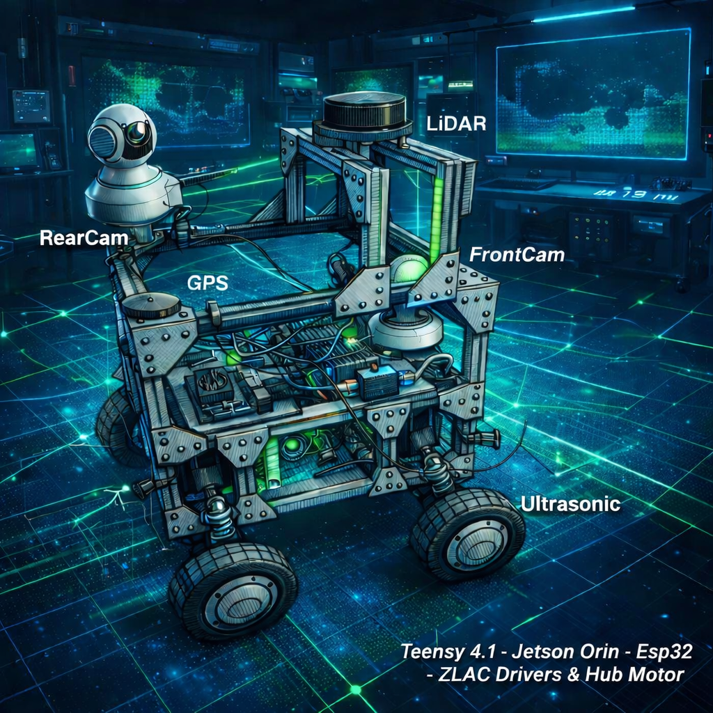
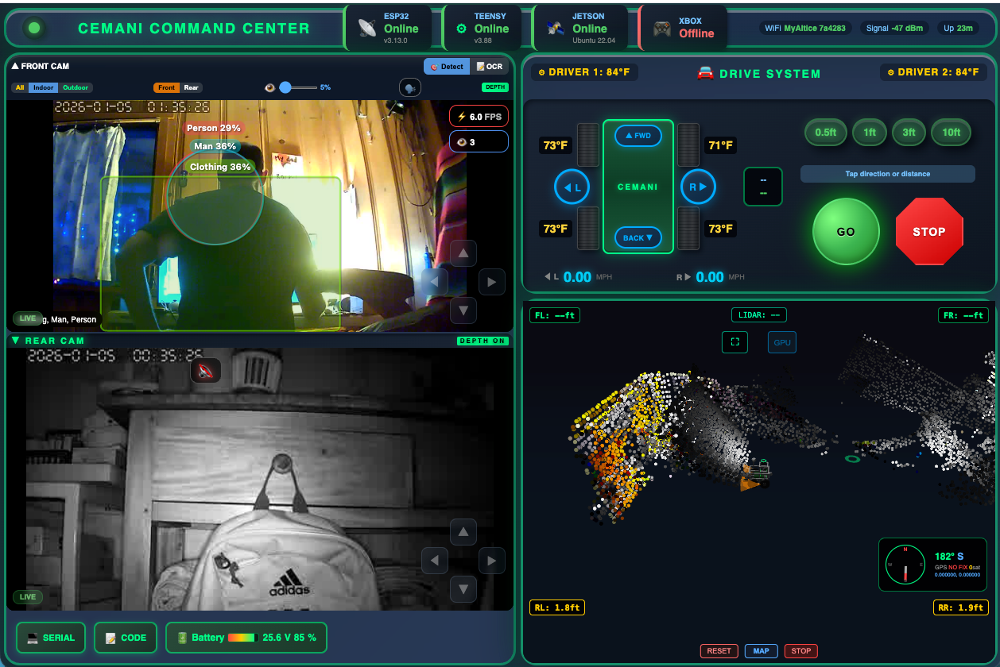

<div align="center">

# Cemani Homestead Robot

<p align="center">
  <a href="https://youtu.be/NWnGvvdvRik">
    
  </a>
  <br>
  <em>▶ Watch the demo on YouTube</em>
</p>


### Autonomous AI-Powered Tank Platform


**Text it commands from your phone. It drives itself, avoids obstacles, detects 601 objects, builds 3D maps, and texts you back.**

A 1kW, four-hub-motor tank robot for a homestead, with its own firmware, a WebSocket control server, a browser command center, and a Jetson "brain" that turns text messages into obstacle-checked moves.

[Demo](#demo) | [What I Built](#what-i-built) | [Robot Brain](#robot-brain) | [3D Mapping](#3d-mapping) | [AI Vision](#ai-vision) | [Architecture](#architecture) | [Hardware](#hardware) | [Roadmap](#roadmap)

---



---

### Command Center



*Real-time web interface: dual PTZ cameras with AI object detection, 3D LIDAR point cloud, and tank drive*

</div>

---

## Demo

### Robot Pulling Firewood Cart

https://github.com/user-attachments/assets/6a05e239-ce66-46ee-b951-474730370bfe

*1kW tank platform pulling a loaded metal cart around the homestead.*

---

<table>
<tr>
<td width="33%">

https://github.com/user-attachments/assets/9921ebb9-426a-4740-9e35-a875a7818416

*Mobility test*

</td>
<td width="33%">

https://github.com/user-attachments/assets/a52f8c41-8795-4027-825c-4a8bdb81a10c

*Maneuverability*

</td>
<td width="33%">

https://github.com/user-attachments/assets/fd26b6ea-948a-4a99-8cf5-652a429bc2db

*Speed test*

</td>
</tr>
</table>

---

## What I Built

Designed, wired and coded by **Matt Macosko**. Every layer below is original code in this repo:

- **Motor firmware** ([`teensy-robot/src/main.cpp`](teensy-robot/src/main.cpp), [`modbus.cpp`](teensy-robot/src/modbus.cpp), [`safety.cpp`](teensy-robot/src/safety.cpp)): Teensy 4.1 drives two ZLAC8015D drivers over Modbus RS-485, caps autonomous `AUTO_*` commands at 10 RPM, and stops if commands stop arriving for 500ms.
- **Wireless bridge** ([`esp32-robot-controller/src/main.cpp`](esp32-robot-controller/src/main.cpp)): ESP32 links the Teensy to the server over WiFi and reads the Xbox controller.
- **Control server** ([`vps-server/server.js`](vps-server/server.js), [`server-odometry.js`](vps-server/server-odometry.js), [`server-navigation.js`](vps-server/server-navigation.js), [`server-scan-matcher.js`](vps-server/server-scan-matcher.js)): Node.js WebSocket hub with encoder odometry, an occupancy grid with A* pathfinding and frontier exploration, and LIDAR-fingerprint loop closure.
- **Command center UI** ([`vps-server/public/index.html`](vps-server/public/index.html), [`js/lidar3d.js`](vps-server/public/js/lidar3d.js), [`js/gamepad-control.js`](vps-server/public/js/gamepad-control.js)): browser dashboard with camera feeds, 3D LIDAR view and tank drive.
- **Robot brain** ([`robot-brain/brain.py`](robot-brain/brain.py)): distance and turn moves from encoder feedback, obstacle checks from LIDAR and ultrasonics, text and HTTP control.
- **Detection pipeline** ([`jetson-object-detection/detect.py`](jetson-object-detection/detect.py), [`object_tracker.py`](jetson-object-detection/object_tracker.py)): tracking, context-aware thresholds and indoor/outdoor/living filters wrapped around an upstream YOLOv8 model.
- **LIDAR relay** ([`jetson-lidar/lidar_relay.py`](jetson-lidar/lidar_relay.py)) and **3D mapper** ([`mac-visualizer/hybrid_3d_mapper.py`](mac-visualizer/hybrid_3d_mapper.py)): streams RPLidar scans and fuses them with monocular depth.

**Upstream, not mine:** YOLOv8 and the OIV7 weights (Ultralytics), Depth Anything V2, the Claude API (Anthropic, `claude-haiku-4-5` for command parsing), Bluepad32 (Xbox on ESP32), Three.js, and the ZLAC/ZLLG vendor manuals included for reference. See [CREDITS.md](CREDITS.md).

---

## Robot Brain

**Text your robot from your phone. It understands natural language, moves autonomously, and reports back.**

### Phone Commands

| You Text | Robot Does |
|----------|-----------|
| `forward 6` | Drives forward 6 feet, avoids obstacles |
| `back 3` | Reverses 3 feet |
| `turn left 90` | Turns left 90 degrees |
| `explore` | Wanders autonomously, avoiding everything |
| `home` | Returns to starting position |
| `status` | Texts back position, battery, obstacles |
| `check the yard` | Anything unrecognized goes to Claude, which maps it to one of the commands above |
| `stop` | Emergency stop |

> **Known issue:** the text parser matches the prefix `go` as "forward", so `go home`, `go back` or `go check the yard` currently drive forward 3 feet instead. Use `home`, `back 3`, or the HTTP `go_home` action until [`brain.py`](robot-brain/brain.py) is fixed.

### How It Works

```
Your Phone (iMessage)
    |
    v
Mac Mini (message relay, not in this repo)
    |
    v
Jetson Orin Nano (robot-brain/brain.py)
    ├── Claude API parses natural language
    ├── Plans movement from sensor data
    ├── LIDAR + ultrasonic obstacle avoidance
    └── Sends motor commands via WebSocket
            |
            v
      VPS Server (command routing)
            |
            v
      ESP32 -> Teensy 4.1 -> Motors
```

### Web Command Center

The server relays `brain_command` messages from the browser to the brain, and the brain answers with `brain_status` and `brain_result` (forward, backward, turn, explore, go_home, stop, set_home, text). The **BRAIN** panel UI that sends these is not included in this repo snapshot; the committed UI has its own EXPLORE button that uses the server-side navigator.

### Texting: what you need to supply

`brain.py` does not talk to iMessage directly. It reads incoming texts from `~/.claude/mobile-inbox.txt` and replies by running `~/send-imessage.sh`. Neither file, nor the Mac relay that fills them, is in this repo, so phone control needs your own bridge. The HTTP API below works without it.

### API

```bash
# Start the brain on Jetson (needs websocket-client and ANTHROPIC_API_KEY for the Claude fallback)
pip install -r robot-brain/requirements.txt
cd robot-brain && bash start.sh

# HTTP endpoints (port 5000)
curl -X POST localhost:5000/command -d '{"action":"forward","value":3}'
curl -X POST localhost:5000/text -d '{"text":"go forward 6 feet"}'
curl localhost:5000/status
```

---

## 3D Mapping

**Real-time photorealistic 3D environment mapping using sensor fusion**

```
PTZ Cameras (2x)         RPLidar A1M8 (360°)
      |                        |
      v                        v
Depth Anything V2        Laser Point Cloud
(Mac M1 GPU)             (8000 samples/sec)
      |                        |
      +--------+-------+------+
               |
        Point Cloud Fusion
        • Voxel grid (10cm cells)
        • Dynamic vs static classification
        • Wall confirmation (3+ observations)
        • 1M point photorealistic output
               |
               v
        Three.js 3D Visualization
        (live in browser)
```

| Feature | Detail |
|---------|--------|
| **Monocular Depth** | Depth Anything V2 from single camera |
| **LIDAR Fusion** | Laser calibrates monocular depth scale |
| **PTZ Scanning** | Automated camera sweep patterns |
| **Dead Reckoning** | Encoder-based odometry (4096 counts/rev) |
| **Persistence** | Confirmed walls save to disk |

---

## AI Vision

**601-class real-time object detection on Jetson Orin Nano**

- **YOLOv8n trained on Open Images V7** (`yolov8n-oiv7`), run through a TensorRT engine when present (~11ms per frame)
- **Indoor mode:** furniture, appliances, household items
- **Outdoor mode:** vehicles, wildlife, landscape
- **Living mode:** people, animals, threats (the autonomous navigator in [`autonomous.py`](jetson-object-detection/autonomous.py) stops for these)
- Detections overlay on live camera feeds in browser

---

## Architecture

```
┌──────────────────────────────────────────────────────────────┐
│                                                                │
│   Phone ──► Mac ──► Jetson (Robot Brain)                      │
│                        ├── YOLOv8 Detection                   │
│                        ├── LIDAR Streaming                    │
│                        └── Autonomous Navigation              │
│                              |                                 │
│   Browser ◄──► VPS Server (WebSocket Hub) ◄──► ESP32          │
│                     ├── Command routing          |             │
│                     ├── Frame relay          Teensy 4.1        │
│                     └── Brain control         ├── Modbus       │
│                              |                ├── Sensors      │
│                         Mac Mini M1           └── Motors       │
│                         └── Depth Anything V2                  │
│                         └── 3D Mapping                         │
│                                                                │
└──────────────────────────────────────────────────────────────┘
```

### Compute Stack

| Device | Role |
|--------|------|
| **Teensy 4.1** | Motor control, Modbus, sensors, safety watchdog |
| **ESP32** | WiFi/Bluetooth bridge, Xbox controller (Bluepad32) |
| **Jetson Orin Nano Super** | Robot brain, YOLOv8, LIDAR relay |
| **Mac Mini M1** | Depth Anything V2, 3D mapping, iMessage relay |
| **VPS** | WebSocket hub, web UI hosting, API |

---

## Hardware

| Component | Specification |
|-----------|---------------|
| **Drive** | 4x ZLLG80ASM250 hub motors (250W each, 1kW total) |
| **Drivers** | 2x ZLAC8015D (Modbus RS-485) |
| **LIDAR** | RPLidar A1M8 (360°, 8000 samples/sec, 12m range) |
| **Cameras** | 2x Sricam PTZ (1080p, ONVIF, pan/tilt) |
| **Ultrasonics** | 4x JSN-SR04T (corners: FL, FR, RL, RR) |
| **Compass** | HMC5883L magnetometer |
| **GPS** | Serial @ 38400 baud |
| **Encoders** | 4096 counts/rev (built into ZLAC drivers) |
| **Power** | 24V LiFePO4 8S, 720Wh |
| **Wheels** | 10" pneumatic, direct hub motor drive |
| **Frame** | 2020 aluminum extrusion |
| **Weight** | ~80 lbs, 100+ lbs payload tested |
| **Speed** | ~4.8 mph turbo (200 RPM firmware cap), ~0.24 mph autonomous (10 RPM cap) |

---

## Code Structure

```
CemaniHomesteadRobot/
├── robot-brain/               # Autonomous movement + text control + Claude AI
├── teensy-robot/              # Motor control, Modbus, sensors, safety
├── esp32-robot-controller/    # WiFi/BT bridge, Xbox controller
├── vps-server/                # Web UI, WebSocket hub, command routing
├── jetson-object-detection/   # YOLOv8 TensorRT + autonomous navigation
├── jetson-lidar/              # RPLidar A1 streaming
├── mac-visualizer/            # Depth Anything V2, 3D mapping pipeline
├── mac-camera-relay/          # PTZ camera control relay
└── docs/                      # Diagrams, screenshots
```

---

## 🛠️ Setup — Configure These Before Running

This repo was scrubbed of secrets before being made public. If you clone it and try to run it as-is, you'll see placeholder values where real network addresses and credentials used to be. **You need to replace them with your own before anything actually connects to anything.**

### Placeholders in the repo

| Placeholder | What it is | Where to find |
|---|---|---|
| `YOUR_VPS_IP` | Public IP / hostname of the VPS running `vps-server/` (Node.js + pm2) | Every `.py` / `.js` / `.md` / `.sh` with a `ws://` or `http://` URL |
| `YOUR_VPS_IP` (robot brain) | Brain's WebSocket URL, and where `start.sh` fetches `ANTHROPIC_API_KEY` over SSH | `robot-brain/brain.py` and `robot-brain/start.sh`; or export `ANTHROPIC_API_KEY` yourself |
| `YOUR_JETSON_IP` | LAN IP of your Jetson Orin Nano running `jetson-lidar/` and `jetson-object-detection/` | `launch_map1.sh` and a couple of Python files |
| `YOUR_CAMERA_PASSWORD` | RTSP password for your ONVIF PTZ cameras | `mac-visualizer/hybrid_3d_mapper.py`, `jetson-object-detection/*.py`, `mac-camera-relay/README.md` |
| `config.example.json` files | Per-service config (camera IPs, VPS auth, etc.) | Copy each `config.example.json` to `config.json` and fill in. `config.json` is gitignored so your real values never get committed. |

### The launcher script

`launch_map1.sh` now reads `VPS_HOST` and `JETSON_HOST` from environment variables. Set them before running:

```bash
export VPS_HOST="root@1.2.3.4"
export JETSON_HOST="jetson@192.168.1.31"
bash launch_map1.sh
```

And set up SSH key authentication for both hosts — the original script shipped with `sshpass -p 'jetson'` (NVIDIA's default Jetson password), which is exactly the kind of pattern that should never be in a public repo. Generate SSH keys and `ssh-copy-id` them to both hosts before running anything.

### 🔒 What's *not* in this repo (on purpose)

The `.gitignore` already excludes real secret files — you'll see `*.example` stubs for each of these but never the real thing:

- `**/credentials.h` (ESP32 WiFi credentials)
- `mac-camera-relay/config.json`, `jetson-camera-relay/config.json`, `jetson-lidar/config.json`, `jetson-object-detection/config.json` (camera passwords)
- `vps-server/auth.json` (VPS login)
- `.env`, `.env.*`
- `*.pem`, `*.key`, `id_rsa*` (SSH keys)
- `private/`, `secrets/`

If you add new secrets while working on your fork, put them in a file that matches one of those patterns — or add a new line to `.gitignore` — so they stay out of git.

---

## Roadmap

### Working Now
- [x] Tank drive with Xbox controller + web joystick
- [x] Dual PTZ camera streaming with depth overlay
- [x] 601-class AI object detection (YOLOv8 + TensorRT)
- [x] 360° LIDAR with 3D point cloud visualization
- [x] Hybrid 3D mapping (LIDAR + monocular depth fusion)
- [x] Encoder-based dead reckoning odometry
- [x] Autonomous mapping with obstacle avoidance
- [x] Robot Brain with text message control (needs your own iMessage bridge, see above)
- [x] Claude AI natural language command parsing (fallback for unrecognized text)
- [x] Distance-based movement (forward X feet)
- [x] Server relay for brain commands from the web UI
- [x] Indoor SLAM occupancy grid mapping
- [x] Semantic map (named zones, object tracking)
- [x] A* path planning with frontier exploration ([`server-navigation.js`](vps-server/server-navigation.js))
- [x] Loop closure via LIDAR fingerprints ([`server-scan-matcher.js`](vps-server/server-scan-matcher.js))

### Building Next
- [ ] IMU upgrade (BNO085 - accelerometer + gyroscope)
- [ ] Intel RealSense D455 depth camera
- [ ] Auto-docking charging station
- [ ] Predator detection alerts (text when bear/coyote seen)
- [ ] Patrol route scheduling (time-based rounds)

### Future Vision
- [ ] Robotic arm (scoop poop, pour chicken feed, grab objects)
- [ ] Dog walking with leash tension control
- [ ] Chicken coop automation (feeding, door open/close)
- [ ] Voice commands via phone
- [ ] Multi-robot coordination
- [ ] Train engine body shell for giving kids rides

---

## License

Multi-licensed, all copyleft: hardware under CERN-OHL-S-2.0, software under GPL-3.0-or-later, docs and media under CC-BY-SA-4.0. Vendor manuals stay with their manufacturers. See [LICENSE](LICENSE). No warranty: this is a heavy machine that moves under its own power.

---

<div align="center">

**Built on a homestead in Humboldt County, California**

*Started with a chicken predator problem. Now it's an autonomous AI homestead assistant you can text from your phone.*

[GitHub](https://github.com/nicedreamzapp) | [Reddit](https://www.reddit.com/r/robotics/comments/1ov3k5v/)

</div>
